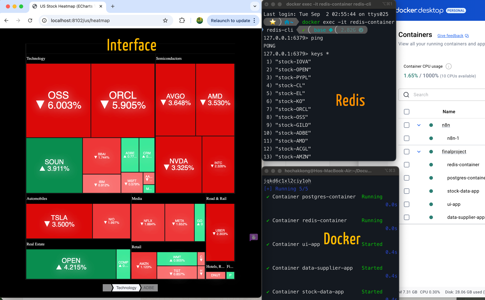

Final Project: Stock Heatmap Application
This application delivers real-time insights into stock performance through an interactive heatmap. Key features include:

**Java & Spring Boot**: The backend utilizes Java and Spring Boot, ensuring a robust and scalable architecture

**Redis**: Fast data retrieval is facilitated by Redis, which efficiently manages stable data that changes infrequently. The Redis cache is cleared every 30 seconds to reflect real-time updates. In a practical scenario, where stock history is relevant, data retention would be adjusted to 24 hours, after which the system queries the database to refresh the Redis cache.

**Real-Time Updates**: Stock data is fetched from Finnhub every 30 seconds, ensuring users have access to the latest information.

**Python Integration**: Historical data is collected using Python, enabling the visualization of trends for selected stocks and providing essential context for investment decisions.