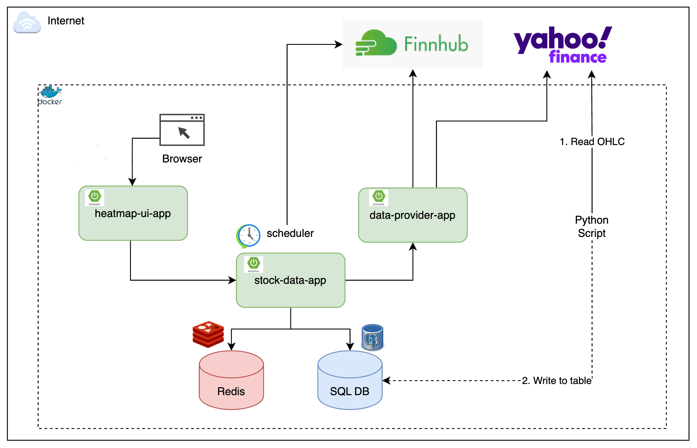
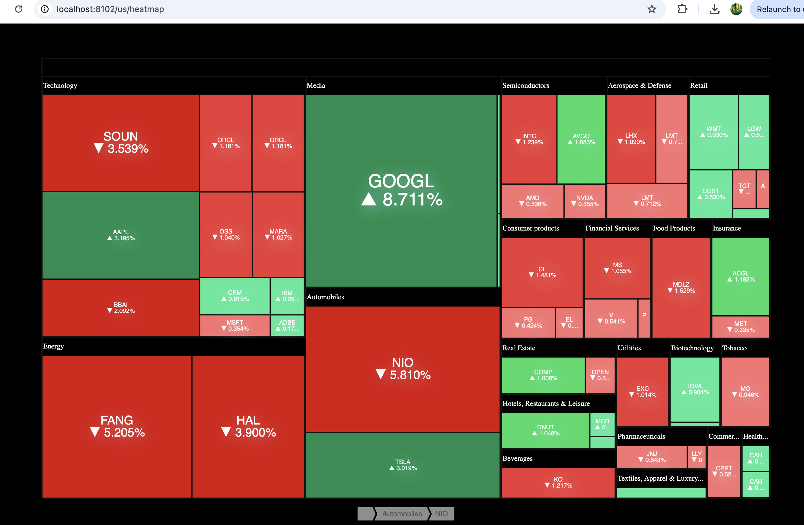
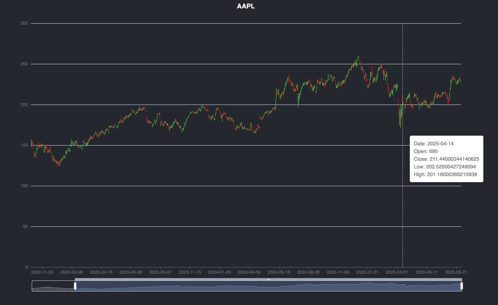

-- **Click the image** to view the video demonstration --

**Final Project: Stock Heatmap Application**
=================================
This application provides real-time insights into stock performance through an interactive heatmap featuring 60 stocks. Key features include:

**Java & Spring Boot with micro-services**: This project utilizes Java and Spring Boot for the backend, providing a robust and scalable architecture. It comprises three microservices that work together to implement the business logic:

1. Data Supplier: This microservice fetches real-time data from Finnhub using four API keys, with each key enabling 15 stock data retrievals.

2. Stock Data: This service obtains real-time data from the Data Supplier and stores historical data in a PostgreSQL database.

3. User Interface: This microservice provides a front-end interface for data visualization, utilizing the ECharts library for interactive and dynamic charts. This allows users to effectively analyze and interpret stock data.

Docker-Compose manages the connections between the Dockerfiles of three microservices. During app development, Postman is utilized to test their functionality. JSON acts as a common data format, enabling seamless communication among the services. Each microservice transforms data transfer objects into entities for database interactions. Port 8102 is exposed for external access, while port 8092 is designated for internal communication.

This microservices architecture is vital because it allows changes to one service without impacting the others. For example, switching the data source from Finnhub to Yahoo or updating the user interface does not affect the other microservices.

**Redis**: Fast data retrieval is facilitated by Redis, which efficiently manages stable data that changes infrequently. The Redis cache is cleared every 30 seconds to reflect real-time updates. In a practical scenario, where stock history is relevant, data retention would be adjusted to 24 hours, after which the system queries the database to refresh the Redis cache.

**Real-Time Updates**: Stock data is fetched from Finnhub every 30 seconds, ensuring users have access to the latest information.

**Python Integration**: In this project, historical daily records are collected using Python, enabling the visualization of trends for selected stocks and offering essential context for investment decisions. Since 2022, approximately 46,000 records have been gathered for about 60 stocks. When Docker runs, this historical data will be fetched from Yahoo and stored in the database.

================================= 
**Component Diagram** 
 

================================= 
-- **Click the image** below to view the fast-forward video of the heatmap stock changes -- 
 

Candlestick chart for a specific stock, illustrating its historical trends 

