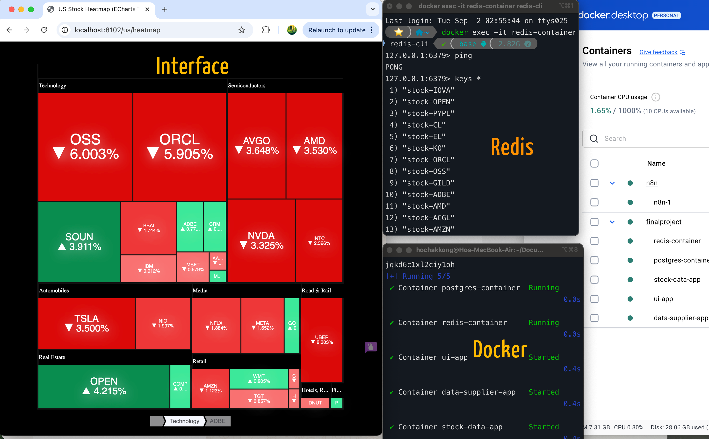
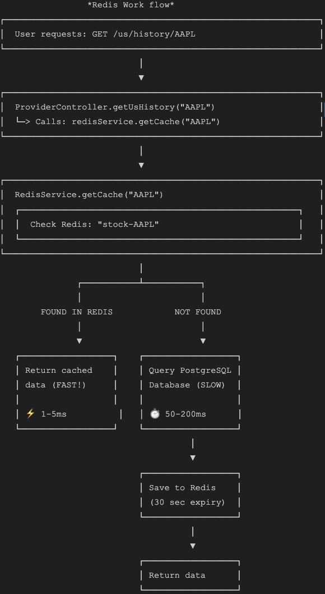
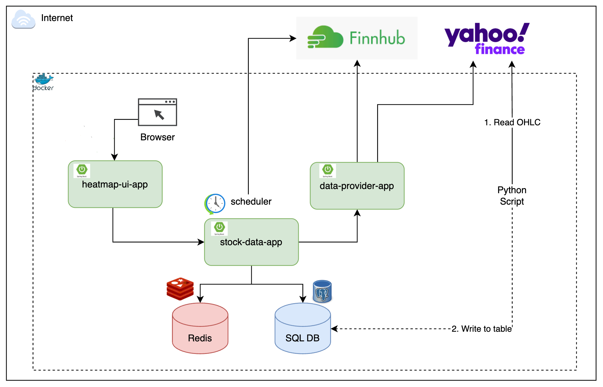
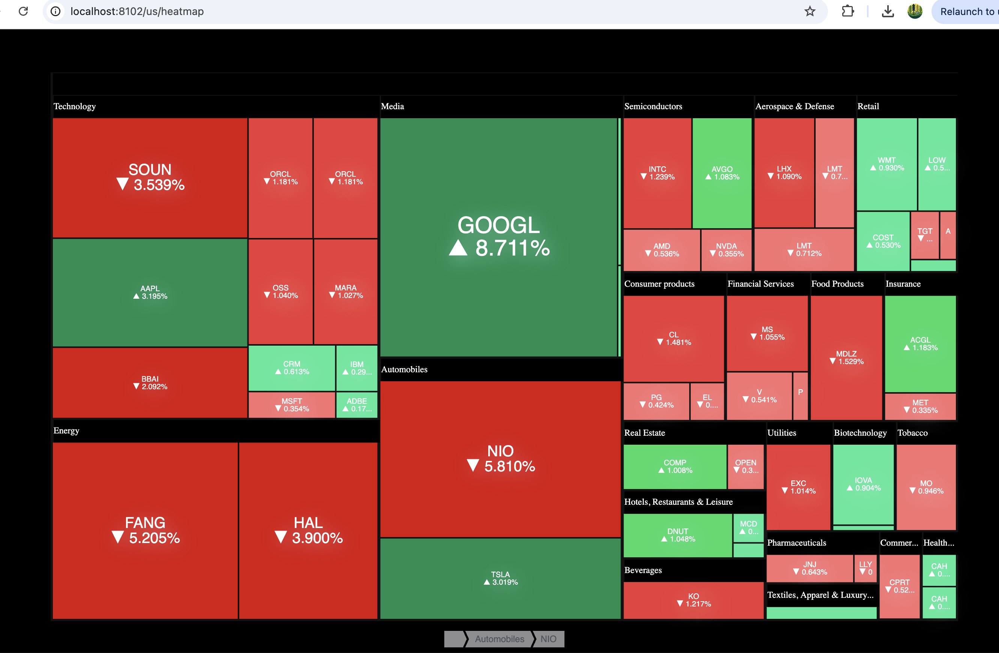
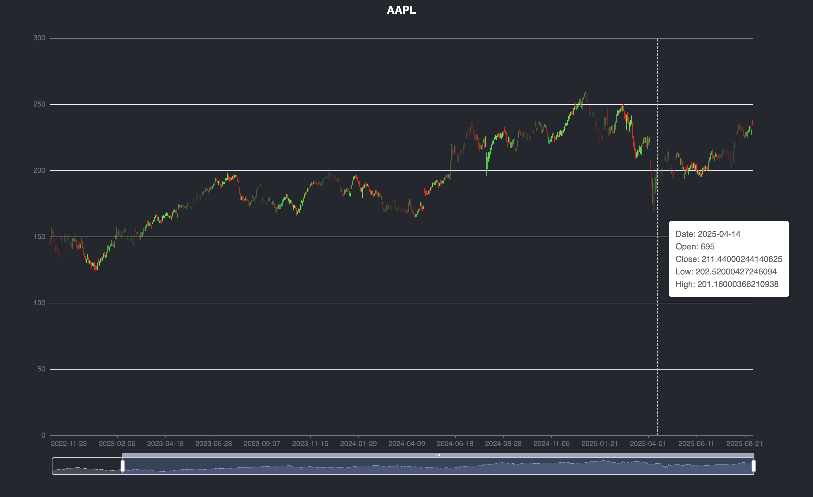

-- **Click the image** to view the video demonstration --

US Stock Heatmap Link: http://34.169.230.10:8102/us/heatmap 
Video Back-End Present: https://vimeo.com/manage/videos/1115271799  

**Step of deploying application**
===============================
0. Prerequisite : Docker installation for Docker-compose deployment
1. git clone the project to your location
2. cd to the project folder
3. run `docker_env_setup.sh` to build and run the docker containers

**Final Project: Stock Heatmap Application**
=================================
This application provides real-time insights into stock performance through an interactive heatmap featuring 60 stocks. Stock data is fetched from Finnhub every 30 seconds, ensuring users have access to the latest information. Key features include :

**Java & Spring Boot with micro-services**: This project utilizes Java and Spring Boot for the backend, providing a robust and scalable architecture. It comprises three microservices that work together to implement the business logic, where DTO and Entity serve as important medium to transfrom information between API message (DTO) <-> Database data (Entity):

*Difference between DTO & Entty*
 **#** | **Aspect**    | **Entity**                               | **DTO**                      
-------|---------------|------------------------------------------|------------------------------
 1     | Location      | Database layer                           | API/Service layer            
 2     | Annotations   | JPA annotations (@Entity, @Column, etc.) | No database annotations      
 3     | Purpose       | Database operations                      | Data transfer                
 4     | Relationships | Can have @ManyToOne, @OneToMany          | No relationships             
 5     | Data Source   | Single database table                    | Can combine multiple sources 
 6     | Used By       | Repository, Service (internal)           | Controller, API responses 

**Microservices Architecture**: The application is structured into three distinct microservices, each responsible for specific functionalities:
1. Data Supplier: This microservice fetches real-time data from Finnhub using 4 API keys, with each key enabling 15 stock data retrievals.

2. Stock Data: This service obtains real-time data from the Data Supplier and stores historical data in a PostgreSQL database.

3. User Interface: This microservice provides a front-end interface for data visualization, utilizing the ECharts library for interactive and dynamic charts. This allows users to effectively analyze and interpret stock data. 

This microservices architecture allows changes to one service without impacting the others. For example, switching the data source from Finnhub to Yahoo or updating the user interface does not affect the other microservices.

*The 3-Layer Architecture*
┌─────────────────────────────────────────────────────────────────┐
│                    UI SERVICE (Port 8092)                       │
├─────────────────────────────────────────────────────────────────┤
│  Controllers:                                                   │
│  ├─ MainPageController (@Controller) → returns HTML views       │
│  └─ ProviderController (@RestController) → returns JSON         │
│                                                                 │
│  Services:                                                      │
│  └─ UiService → Calls stock-data-app via RestTemplate           │
│     (No Repository - acts as API gateway)                       │
└─────────────────────────────────────────────────────────────────┘
                            │
                            │ HTTP (RestTemplate)
                            ▼
┌─────────────────────────────────────────────────────────────────┐
│                STOCK-DATA SERVICE (Port 8091)                   │
├─────────────────────────────────────────────────────────────────┤
│  Controllers:                                                   │
│  └─ ProviderController (@RestController)                        │
│     ├─ getFinnhub() → calls ProviderService                     │
│     ├─ getUsHistory() → calls RedisService                      │
│     └─ getProfile() → calls ProviderService                     │
│                                                                 │
│  Services:                                                      │
│  ├─ ProviderService → Business logic                            │
│  │  ├─ Calls data-supplier-app via RestTemplate                 │
│  │  └─ Uses Repositories for database operations                │
│  └─ RedisService → Caching layer                                │
│                                                                 │
│  Repositories:                                                  │
│  ├─ FinnhubRepository → JPA operations on FinnhubEntity         │
│  ├─ HistoryRepository → JPA operations on HistoryEntity         │
│  └─ ProfileRepository → JPA operations on ProfileEntity         │
└─────────────────────────────────────────────────────────────────┘
                            │
                            │ HTTP (RestTemplate)
                            ▼
┌─────────────────────────────────────────────────────────────────┐
│              DATA-SUPPLIER SERVICE (Port 8090)                  │
├─────────────────────────────────────────────────────────────────┤
│  Controllers:                                                   │
│  └─ QuoteController (@RestController)                           │
│     ├─ getUsStock() → calls QuoteService                        │
│     └─ getUsProfile() → calls QuoteService                      │
│                                                                 │
│  Services:                                                      │
│  └─ QuoteService → Fetches data from external Finnhub API       │
│     (No Repository - external API calls only)                   │
└─────────────────────────────────────────────────────────────────┘

**Rule of Micro-service** 
 **#** | **Layer**  | **Can Access**                                | **Cannot Access**                   
-------|------------|-----------------------------------------------|-------------------------------------
 1     | Controller | ✅ Services, Mappers                           | ❌ Repositories, Entities (directly) 
 2     | Service    | ✅ Repositories, Other Services, External APIs | ❌ Controllers                       
 3     | Repository | ✅ Database (via JPA)                          | ❌ Services, Controllers   

Separation of concerns:
  - Controllers handle HTTP requests/responses
  - Services contain business logic
  - Repositories handle database operations
Dependency injection:
  - @Autowired for dependency injection ("Hey Spring, please give me this object", reducing works in "new" an object = Creates an instance of it automatically)
  - Controllers inject Services
  - Services inject Repositories
Microservices communication:
  - Services communicate via RestTemplate (HTTP)
  - No direct database access across services

 
**Advantage of this Architecture** 
Separation of concerns: Each layer has a single responsibility
Testability:            Easy to mock services/repositories
Maintainability:        Changes in one layer don't break others
Reusability:            Services can be used by multiple controllers
Security:               Controllers don't expose database details

**Docker**
Docker-Compose manages the connections between the Dockerfiles of three microservices. During app development, Postman is utilized to test their functionality. JSON acts as a common data format, enabling seamless communication among the services. Each microservice transforms data transfer objects into entities for database interactions. Port 8102 is exposed for external access, while port 8092 is designated for internal micro-service communication.

**Redis**: Fast data retrieval is facilitated by Redis, which efficiently manages stable data that changes infrequently. The Redis cache is cleared every 30 seconds to reflect real-time updates. In a practical scenario, where stock history is relevant, data retention would be adjusted to 24 hours, after which the system queries the database to refresh the Redis cache.  

*Without Redis*
User Request → Controller → Service → Database (PostgreSQL) → Return Data
                                    ⬆️
                              Slow! Every time queries DB     
*With Redis*
User Request → Controller → RedisService → Redis Cache → Return Data (FAST!)
      ⬇️ (if not found)
Database (PostgreSQL) → Save to Redis → Return Data 

 

**Python Integration**: In this project, historical daily records are collected using Python, enabling the visualization of trends for selected stocks and offering essential context for investment decisions. Since 2022, approximately 46,000 records have been gathered for about 60 stocks. When Docker runs, this historical data will be fetched from Yahoo and stored in the database.

================================= 
**Component Diagram** 
 

================================= 
-- **Click the image** below to view the fast-forward video of the heatmap stock changes -- 
 

Candlestick chart for a specific stock, illustrating its historical trends 

